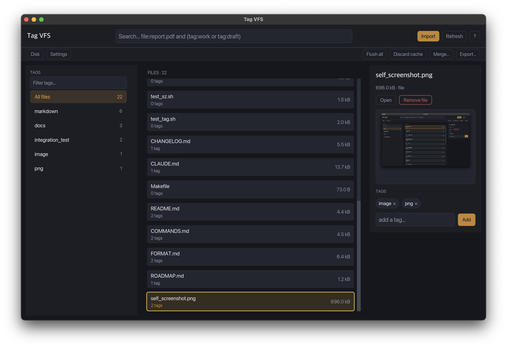

<div align="center">

# tag-vfs

**A tag-based virtual file system with a desktop GUI, built in Rust.**

[](https://github.com/sameer-n012/tag-vfs/releases)
[](https://www.rust-lang.org)



</div>

---

`tag-vfs` is a tag-based virtual file system.

The system stores files by tags. It does not use folders. You add one or more tags to each file. You find files by their tags, not by a folder path.

The system stores all files in one archive file. The archive file has the extension `.dat`. The archive uses a custom binary format. See [docs/FORMAT.md](docs/FORMAT.md) for the full format.

## Install and build

The project uses Rust and Cargo. The build produces two binaries:

| Binary | Content |
|---|---|
| `tag-vfs` | Interactive shell plus GUI. Needs the `gui` Cargo feature, which is on by default. |
| `tag-vfs-cli` | Interactive shell only. No GUI code, no `iced`/`rfd` dependency. |

```bash
# Build both binaries
cargo build

# Build the CLI-only binary, with no GUI dependencies
cargo build --bin tag-vfs-cli --no-default-features

# Build the release binaries
cargo build --release
```

## Quick start

Run `tag-vfs-cli` to start the interactive command shell:

```bash
cargo run --bin tag-vfs-cli
```

The shell creates an archive at `~/tag_vfs/archive.dat` on first run. Use `--home <DIR>` to pick a different location:

```bash
cargo run --bin tag-vfs-cli -- --home /path/to/data
```

Example session:

```
> import notes.txt
> tag work -f notes.txt
> ls work
> sz work
> stat notes.txt
```

See [docs/COMMANDS.md](docs/COMMANDS.md) for the full command reference.

## GUI

Run `tag-vfs` with `--gui` to open the desktop GUI instead of the shell:

```bash
cargo run --bin tag-vfs -- --gui
```

The GUI has three panels: a tag sidebar (searchable, sorted by file count), a file list (filtered by the selected tag and by the header search bar), and a detail panel for the selected file — add or remove tags, open the file with the system viewer, remove it from the archive, and preview images and videos.

The header search bar takes a query, not a plain substring: combine `file:` and `tag:` terms with `and` / `or` and parentheses, e.g. `file:report.pdf and (tag:work or tag:draft)`. Both `file:` and `tag:` require an exact (case-insensitive) match.

A second toolbar row covers the rest of the CLI's commands: **Disk** (usage stats per archive section), **Settings** (current config, read-only), **Flush all** / **Discard cache** (commit or drop changes to files opened with Open), **Merge…** (ingest another `.dat` file), and **Export…** (write the whole archive to a directory). `apply` and `scrape` have no GUI entry point — they're no-op stubs in the CLI too.

### Keyboard shortcuts

Every GUI action has a keyboard shortcut. Shortcuts use the platform "command" key (⌘ on macOS, Ctrl elsewhere) so they never collide with typing in a search or tag box.

| Key | Action |
|---|---|
| ↑ / ↓ | Move selection in the file list |
| Cmd+↑ / Cmd+↓ | Move selection in the tag sidebar |
| Cmd+F | Focus the file search bar |
| Cmd+Shift+F | Focus the tag filter box |
| Cmd+T | Focus the "add a tag…" box (press Enter there to add) |
| Cmd+Shift+Backspace | Remove the tag currently typed in the tag box, from the selected file |
| Cmd+I | Import files |
| Cmd+O | Open the selected file |
| Cmd+Backspace | Remove the selected file |
| Cmd+R | Refresh |
| Cmd+D | Show disk usage |
| Cmd+, | Show settings |
| Cmd+M | Merge an archive |
| Cmd+E | Export the archive |
| Cmd+S | Flush all cached changes |
| Cmd+Shift+S | Discard all cached changes |
| Cmd+Q | Quit |
| Cmd+/ | Show/hide the keyboard shortcuts help (also available from the **?** button, top right) |
| Esc | Go back — closes the help/Disk/Settings panel, then clears the search, then clears the tag filter |

## Documentation

| File | Content |
|---|---|
| [docs/COMMANDS.md](docs/COMMANDS.md) | Full CLI command reference |
| [docs/FORMAT.md](docs/FORMAT.md) | The `.dat` binary archive format |
| [docs/ROADMAP.md](docs/ROADMAP.md) | Open work items |
| [CHANGELOG.md](CHANGELOG.md) | Fixed bugs and completed milestones |

## Testing

```bash
# Rust unit tests
cargo test --lib -- --test-threads=1

# Bash integration tests (needs a built binary)
bash tests/run_all.sh
```

See [CLAUDE.md](CLAUDE.md) for full test details.

## Releases

Every push to `main` builds macOS release binaries and publishes them to the GitHub Releases page (`.github/workflows/release.yml`). The release is tagged `v<version>`, read from `Cargo.toml`. **Bump the version in `Cargo.toml` before pushing to `main`** — if a release for the current version already exists, the workflow fails instead of overwriting it.
